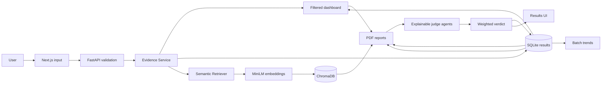

# LLM Response Evaluation System

## Overview

An explainable, multi-agent, RAG-based system for evaluating AI-generated responses. The application prepares provenance-rich evidence, evaluates relevance, accuracy, groundedness/hallucination, and completeness, produces a transparent weighted verdict, compares stored batches, and exports evidence-rich PDF reports.

## Problem Statement

LLM responses may sound plausible while being incomplete, irrelevant, or unsupported. Responsible evaluation needs more than a single opaque score: it needs trusted evidence, traceable provenance, distinct evaluation dimensions, reproducible retrieval, and validation against benchmarks.

## Objective

Provide an end-to-end local evaluation workflow from user submission and RAG evidence through explainable scoring, batch analytics, drill-down, and professional reporting.

## Features

- Responsive Next.js evaluation form with validation and request states
- FastAPI endpoint with strict, whitespace-normalizing Pydantic schemas
- SQuAD and TruthfulQA ingestion through Hugging Face `datasets`
- Common validated benchmark-document representation
- Conservative cleaning, duplicate handling, configurable overlap chunking
- Cached local `all-MiniLM-L6-v2` embedding service
- Persistent cosine-distance Chroma collection with idempotent upserts
- Configurable Top-K semantic retrieval with provenance metadata
- Direct reference evidence and temporary in-memory source-text ranking
- Typed evidence package designed for future judge agents
- Actual Hit@1, Hit@3, Hit@5, and MRR@5 retrieval measurement
- Backend tests for validation, normalization, chunking, retrieval, and evidence policy
- Explainable relevance, accuracy, hallucination, and completeness agents
- Claim-level supported, unsupported, and contradicted classifications
- Configurable weighted verdict with retained component explanations
- Batch evaluation, SQLite history, and dashboard summaries
- CSV upload with per-row validation and failure isolation
- Pass / needs improvement / fail rates, score distributions, recurring issues, and batch trends
- Filters by outcome, score, batch, and AI system/response source
- Individual evaluation drill-down and downloadable PDF batch reports

## Milestone Roadmap

### Milestone 1 — implemented

Foundation, input UI/API, benchmark knowledge base, RAG retrieval, evidence packaging, retrieval validation, and documentation.

### Milestone 2 — implemented

Relevance, accuracy, and hallucination judge agents plus an evaluation orchestrator and validated structured outputs.

### Milestone 3 — implemented

Completeness and verdict agents, explicit weighted policy, persisted runs, batch evaluation, and analytics dashboard.

### Milestone 4 — implemented

CSV batch ingestion, row-level failure isolation, system comparison metadata, advanced filtered analytics, score distributions, issue and evidence-quality frequencies, per-batch trends, result drill-down, PDF reporting, and final documentation.

## System Architecture



The complete future architecture and information flow are in [`docs/architecture.md`](docs/architecture.md). A code-aligned explanation of the current API, ingestion pipeline, evidence selection, retrieval behavior, errors, and verification procedure is in [`docs/backend-working-procedure.md`](docs/backend-working-procedure.md).

## Tech Stack

Next.js, TypeScript, Tailwind CSS, Python, FastAPI, Pydantic, Hugging Face Datasets, Sentence Transformers, ChromaDB, NumPy, Pandas, Pytest, and Uvicorn. Selection rationale is documented in [`docs/tech-stack.md`](docs/tech-stack.md).

## Project Structure

```text
.
├── backend/
│   ├── api/evaluation.py
│   ├── core/config.py
│   ├── datasets/{normalizer,squad_loader,truthfulqa_loader}.py
│   ├── models/evaluation.py
│   ├── rag/{cleaner,chunker,embeddings,loader,retriever,vector_store}.py
│   ├── services/evidence_service.py
│   └── main.py
├── frontend/
│   ├── app/
│   ├── components/
│   ├── lib/
│   └── types/
├── scripts/{ingest_datasets,evaluate_retrieval}.py
├── tests/
├── docs/
├── data/
├── .env.example
├── requirements.txt
└── README.md
```

## Installation

Prerequisites: Node.js 20+ and Python 3.11 or 3.12. From the repository root on PowerShell:

```powershell
Copy-Item .env.example .env
uv venv --python 3.11
.\.venv\Scripts\Activate.ps1
uv pip install -r requirements.txt
Set-Location frontend
npm install
Set-Location ..
```

With a preinstalled Python interpreter, `python -m venv .venv` and `python -m pip install -r requirements.txt` are equivalent alternatives.

## Backend Setup

Configuration is loaded from the root `.env`. Start from the repository root with the virtual environment active:

```powershell
python -m uvicorn backend.main:app --host 127.0.0.1 --port 8000 --reload
```

Health check: `GET http://localhost:8000/health`. Interactive API documentation: `http://localhost:8000/docs`.

## Frontend Setup

For a non-default backend URL, create `frontend/.env.local`:

```text
NEXT_PUBLIC_API_URL=http://127.0.0.1:8000
```

Then:

```powershell
Set-Location frontend
npm run dev
```

Open `http://localhost:3000`.

## Render Deployment

The root [`render.yaml`](render.yaml) deploys the complete application on Render as two connected services:

- `evidence-lab-api`: a FastAPI web service that installs the RAG dependencies, builds a development-size SQuAD/TruthfulQA Chroma index, starts Uvicorn, and exposes `/health`.
- `evidence-lab`: a Next.js static site built from `frontend/` and published from `frontend/out`.

The Blueprint wires the generated service URLs automatically. `NEXT_PUBLIC_API_URL` points the frontend to the backend, while `FRONTEND_ORIGIN` permits browser requests from the Render frontend. No manual production URL is required.

1. In Render, create a new Blueprint from this GitHub repository.
2. Apply the `render.yaml` Blueprint.
3. Wait for both services to finish building and for the API health check to pass.
4. Open the `evidence-lab` static-site URL.

Python is pinned to 3.11 to ensure binary wheels are available for the backend dependencies. The frontend uses Next.js static export mode. Render's free web service is suitable for demonstration but sleeps after inactivity and uses an ephemeral filesystem; dashboard records can therefore be lost on restart. Use a paid persistent disk or an external database for durable production history.

## Dataset Ingestion and Vector Index

The single ingestion command downloads both real benchmark datasets, normalizes and chunks them, generates embeddings, and populates Chroma:

```powershell
python scripts/ingest_datasets.py --reset
```

Omit `--reset` for idempotent upserts into the existing collection. In development mode the configured samples are used. To ingest full validation splits, set `DATASET_MODE=full`; this takes longer and requires more disk/memory.

## Running the Application

1. Run ingestion once.
2. Start the backend from the repository root.
3. Start the frontend from `frontend/`.
4. Submit a question and response. Add a trusted reference and/or source material when available.
5. Inspect the verdict, component explanations, claim classifications, missing aspects, and cited evidence. The Batch and Dashboard tabs expose the Milestone 3 flows.

## API

### `GET /health`

Lightweight liveness response that does not load the embedding model.

### `POST /api/v1/evaluations/prepare`

Request:

```json
{
  "question": "What causes the seasons?",
  "ai_response": "The distance from the Sun changes.",
  "reference_answer": null,
  "source_text": null
}
```

`question` and `ai_response` are required non-blank strings. Optional blank strings normalize to `null`. The response contains status, message, and a provenance-bearing `EvidencePackage`.

### `POST /api/v1/evaluations/evaluate`

Accepts the same request and returns a complete structured evaluation containing the `EvidencePackage`, four dimension results, claim analysis, and weighted verdict.

### `POST /api/v1/evaluations/batch`

Accepts `{"items": [...], "batch_name": "...", "system_name": "..."}`. Valid items continue independently; failures are returned with their row/item number.

### `POST /api/v1/evaluations/batch/csv`

Accepts UTF-8 CSV content with required `question` and `ai_response` columns. Optional `reference_answer` and `source_text` columns are supported. Batch and system labels are query parameters.

### `GET /api/v1/evaluations/dashboard`

Returns outcome counts and percentages, averages, score distributions, hallucination and completeness frequencies, recurring issues, batch trends, filter choices, and recent evaluations. Optional filters include outcome/verdict, score range, batch, and system.

### `GET /api/v1/evaluations/reports/batch/{batch_id}.pdf`

Downloads a paginated report generated from the selected batch's stored structured results.

### `GET /api/v1/evaluations/{evaluation_id}`

Returns one saved evaluation or a structured 404 response.

## RAG Pipeline

Benchmark records are loaded into one schema, cleaned, deduplicated, chunked with overlap, embedded in batches, and upserted to Chroma using stable chunk IDs. At request time, a question embedding retrieves Top-K chunks using cosine distance. The API returns both the raw distance and `1 - distance` similarity. Submitted source text follows the same cleaning/chunking/embedding logic but is ranked in memory and never enters the permanent benchmark collection.

Evidence priority is: preserve a supplied reference answer; rank supplied source text; when neither is available, query the benchmark knowledge base. The package has separate fields so direct and retrieved evidence can coexist in future policies.

## Retrieval Evaluation

After ingestion:

```powershell
python scripts/evaluate_retrieval.py --queries 50 --output data/retrieval-evaluation.json
```

The script loads real benchmark questions, retrieves from the actual collection, matches expected document IDs, and computes Hit@1/3/5 and MRR@5. It exits with an error if the index is empty; it never fabricates metrics.

## Testing

```powershell
python -m pytest
Set-Location frontend
npm run build
```

Unit tests isolate external downloads for speed and cover validation, normalization, chunking, retrieval, agent behavior, compatible/conflicting claim details, verdict aggregation, and persistence. Real dataset/model/index behavior is verified by the ingestion and retrieval-evaluation commands.

## Screenshots

Presentation previews and screenshots are generated locally for review before any repository push.

## Current Limitations

- The local judge agents use MiniLM similarity and transparent rules, not a paid external LLM or human fact checker.
- Claim splitting is sentence-level, and contradiction rules are conservative rather than full natural-language inference.
- Batch processing is synchronous and SQLite is intended for local/internship-scale use.
- Render free services can sleep after inactivity, and runtime SQLite records are not durable across restarts without persistent storage.

Detailed requirement maps are available in [`docs/milestone-2.md`](docs/milestone-2.md), [`docs/milestone-3.md`](docs/milestone-3.md), and [`docs/milestone-4.md`](docs/milestone-4.md). The final technical narrative is in [`docs/project-report.md`](docs/project-report.md).

## Configuration

| Variable | Default | Meaning |
|---|---:|---|
| `BACKEND_HOST` | `127.0.0.1` | Bind host used by the documented command |
| `BACKEND_PORT` | `8000` | API port |
| `FRONTEND_ORIGIN` | `http://localhost:3000` | Allowed browser origin |
| `CORS_ORIGIN_REGEX` | empty | Optional trusted-origin regex for deployment preview domains |
| `NEXT_PUBLIC_API_URL` | `http://127.0.0.1:8000` | Browser-visible API base URL |
| `EMBEDDING_MODEL` | `sentence-transformers/all-MiniLM-L6-v2` | Embedding model identifier |
| `HF_CACHE_DIR` | `./data/cache/huggingface` | Ignored local dataset/model cache |
| `CHROMA_PERSIST_DIR` | `./data/chroma` | Local index directory |
| `CHROMA_COLLECTION` | `benchmark_evidence` | Collection name |
| `TOP_K` | `5` | Returned evidence limit |
| `CHUNK_SIZE` | `400` | Approximate whitespace-token window |
| `CHUNK_OVERLAP` | `50` | Overlapping tokens |
| `DATASET_MODE` | `development` | `development` or `full` |
| `SQUAD_SAMPLE_SIZE` | `250` | Development SQuAD records |
| `TRUTHFULQA_SAMPLE_SIZE` | `250` | Development TruthfulQA records |

Chunk parameters are starting values, not universally optimal settings. Tune them with measured retrieval experiments.

## Future Work

Potential extensions include calibrated LLM judges, human review workflows, background workers for very large batches, authentication, experiment/version tracking, confidence intervals, and production object storage. These are outside the four implemented internship milestones.
