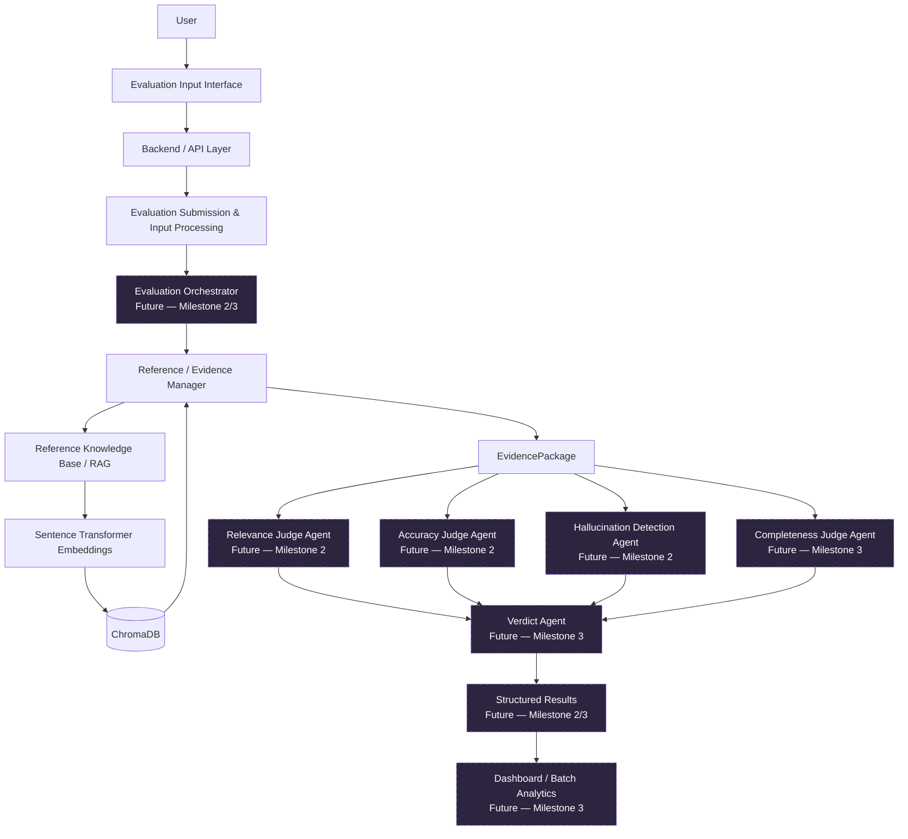

# System Architecture

## Complete roadmap architecture

Only the input, validation, evidence manager, dataset ingestion, embedding, vector storage, retrieval, and `EvidencePackage` portions are implemented in Milestone 1.

## Milestone 1 runtime flow

1. The browser validates required fields and posts JSON to `/api/v1/evaluations/prepare`.
2. Pydantic trims text, converts blank optional fields to `null`, and rejects malformed input.
3. The evidence service creates an immutable evaluation identifier.
4. A reference answer is preserved directly. Submitted source text is cleaned, chunked, embedded, and ranked in memory. If neither is present, the benchmark collection is searched.
5. Chroma returns cosine distances. The vector adapter exposes the original distance and the documented transformation `similarity = 1 - cosine_distance`; it never invents a score.
6. The API returns one typed `EvidencePackage`, which the UI displays without claiming that evaluation has happened.

## Component boundaries

- `backend/datasets`: dataset-specific loading and conversion to `NormalizedDocument`.
- `backend/rag`: dataset-agnostic cleaning, chunking, embedding, persistence, and retrieval.
- `backend/services`: evidence policy and package assembly.
- `backend/models`: stable contracts shared by the API and future agents.
- `frontend`: typed submission and evidence inspection UI.
- `scripts`: repeatable ingestion and measured retrieval validation.

Embedding and vector-store operations sit behind small interfaces/adapters. A future model or database can replace them without changing API schemas or judge inputs.

## Future agent contracts (not implemented)

Each judge will consume an `EvidencePackage` plus a dimension-specific rubric and return a structured result containing a score/label, rationale, cited chunk IDs, confidence, and insufficiency warnings.

- **Relevance Judge:** determine whether the response directly addresses the submitted question. It primarily compares question and response.
- **Accuracy Judge:** compare factual claims with the provided reference answer and/or retrieved evidence, while preserving conflicts and provenance.
- **Hallucination Detection Agent:** extract atomic factual claims and label each `supported`, `unsupported`, or `contradicted`, with cited evidence.
- **Completeness Judge:** identify requested/expected aspects and determine which are covered or missing.
- **Verdict Agent:** aggregate validated dimension results under an explicit, versioned policy. It must not erase lower-level explanations.

Future files can be added under `backend/agents/` and `backend/orchestrator/` without restructuring the RAG foundation.

## Failure behavior

Invalid requests return FastAPI's structured 422 response. Model/database startup failures return a sanitized 503 detail. An empty benchmark index produces a successful evidence package with an explicit warning and `evidence_source_type: none`, allowing the UI to explain the remediation instead of fabricating evidence.

