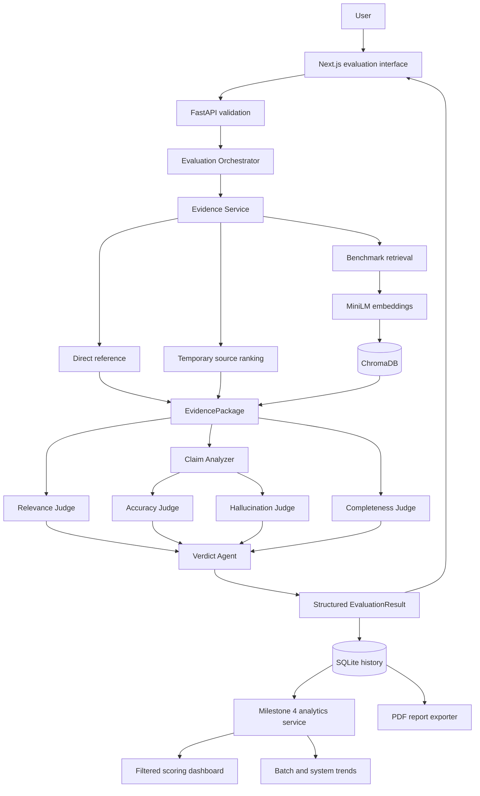

# System Architecture

## Implemented architecture

Milestone 1 provides ingestion, evidence preparation, embeddings, ChromaDB, and retrieval. Milestone 2 adds relevance, claim analysis, accuracy, hallucination, and orchestration. Milestone 3 adds completeness, the weighted verdict, SQLite history, and batch evaluation. Milestone 4 adds failure-isolated CSV batches, analytics, comparison filters, drill-down, and stored-result PDF reports.

## Information flow

1. The browser validates the question and AI response and submits JSON.
2. Pydantic trims input, converts blank optional fields to `null`, and rejects invalid payloads.
3. The Evidence Service preserves a direct reference, ranks supplied source text temporarily, or searches the benchmark index when no direct evidence exists.
4. Every judge consumes the same provenance-bearing `EvidencePackage`.
5. The Relevance Judge compares the question and response. The Claim Analyzer splits the response into factual units and finds the closest evidence for each.
6. Accuracy summarizes supported versus contradicted claims. Hallucination reports each claim as supported, unsupported, or contradicted and exposes a groundedness score.
7. Completeness compares evidence-derived required aspects against the response.
8. The Verdict Agent applies the configured normalized weights and retains all component explanations.
9. The complete result is returned to the UI and stored in SQLite with optional batch and system provenance.
10. The analytics service calculates outcome rates, averages, distributions, claim/gap frequencies, recurring issues, and trends from stored results.
11. The report service reads the same batch records and produces a paginated PDF; it does not rerun evaluation.

## Component boundaries

- `backend/datasets`: dataset-specific loading into `NormalizedDocument`.
- `backend/rag`: cleaning, chunking, embeddings, ChromaDB, and retrieval.
- `backend/services`: evidence selection, batch isolation, analytics, and PDF reporting.
- `backend/agents`: independent, explainable dimension evaluators.
- `backend/orchestrator`: the fixed evaluation workflow.
- `backend/database`: lightweight local result persistence and summaries.
- `backend/models`: API, evidence, agent, batch, and dashboard contracts.
- `frontend`: evaluation, CSV/JSON batch submission, filters, analytics, report export, and drill-down.

Embedding and storage behavior are behind adapters, so a different embedding model, vector database, or future LLM-backed judge can replace an implementation without changing the public result model.

## Judge responsibilities

- **Relevance Judge:** measures whether the response addresses the question.
- **Accuracy Judge:** summarizes claim support against direct or retrieved evidence.
- **Hallucination Detection Agent:** exposes each factual claim and its supported, unsupported, or contradicted status.
- **Completeness Judge:** reports covered and missing evidence-derived aspects.
- **Verdict Agent:** combines available scores using explicit configurable weights: relevance 20%, accuracy 35%, groundedness 25%, and completeness 20% by default.

The current judges are deterministic and local. They use sentence-transformer similarity plus transparent conflict rules; they do not call a paid external LLM and do not claim human-level fact checking.

## Failure behavior

Invalid requests return a structured 422 response. Model, database, or retrieval failures return a sanitized service error. If no evidence is available, claim-level results explicitly remain unsupported rather than inventing facts. Empty benchmark retrieval produces a warning that explains how to build the index.
