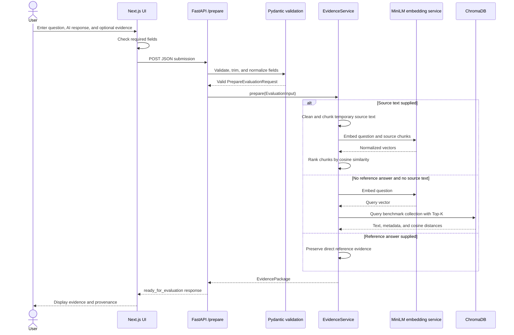
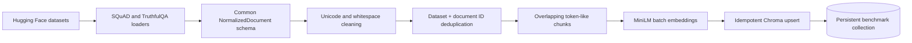

# Backend Working Procedure

## 1. Purpose and Milestone Boundary

The backend prepares trustworthy evidence for evaluating an AI-generated response. It accepts an evaluation submission, validates it, selects the available evidence path, and returns a structured `EvidencePackage` that future judge agents can consume.

Milestone 1 does **not** decide whether the submitted response is accurate, relevant, complete, or hallucinated. It does not call an LLM judge and it does not calculate an overall score. Its final state is `ready_for_evaluation`, which means that evidence preparation has completed and the package is ready for the future Milestone 2 agent layer.

## 2. Backend Components

| Component | Location | Responsibility |
| --- | --- | --- |
| FastAPI application | `backend/main.py` | Creates the application, enables CORS, registers routes, and exposes the health check. |
| Evaluation API | `backend/api/evaluation.py` | Accepts preparation requests and calls the evidence service. |
| Pydantic models | `backend/models/evaluation.py` | Validates input and defines the response contract. |
| Evidence service | `backend/services/evidence_service.py` | Chooses the evidence path and builds the final evidence package. |
| Configuration | `backend/core/config.py` | Loads and validates environment-based settings. |
| Dataset loaders | `backend/datasets/` | Loads SQuAD and TruthfulQA from Hugging Face. |
| Normalizer | `backend/datasets/normalizer.py` | Converts different dataset schemas into one internal schema. |
| Text cleaner | `backend/rag/cleaner.py` | Normalizes Unicode and whitespace and removes duplicate documents. |
| Chunker | `backend/rag/chunker.py` | Splits documents into overlapping chunks while preserving provenance. |
| Embedding service | `backend/rag/embeddings.py` | Loads MiniLM once and creates query/document vectors. |
| Knowledge-base loader | `backend/rag/loader.py` | Batches chunks, creates embeddings, and stores them in ChromaDB. |
| Chroma adapter | `backend/rag/vector_store.py` | Initializes, upserts, queries, and resets the persistent collection. |
| Semantic retriever | `backend/rag/retriever.py` | Converts a question to an embedding and returns typed evidence chunks. |
| Ingestion command | `scripts/ingest_datasets.py` | Builds or updates the benchmark vector index. |
| Retrieval evaluation | `scripts/evaluate_retrieval.py` | Measures Hit@1, Hit@3, Hit@5, and MRR@5 using real retrieval results. |

## 3. High-Level Runtime Flow



## 4. Application Startup

The backend is normally started from the repository root:

```powershell
.\.venv\Scripts\Activate.ps1
uvicorn backend.main:app --reload --host 127.0.0.1 --port 8000
```

During startup:

1. `backend.main` loads the validated settings through `get_settings()`.
2. FastAPI creates the application with the Milestone 1 title and version.
3. CORS is configured for the frontend origin. For local development, both `http://localhost:3000` and `http://127.0.0.1:3000` are accepted.
4. The evaluation router is mounted under `/api/v1/evaluations`.
5. The application exposes the health endpoint at `/health`.

The embedding model and Chroma client are initialized lazily when the first preparation request needs the evidence service. `lru_cache(maxsize=1)` keeps a single evidence-service instance and a single embedding-model instance in each backend process. This avoids reloading the model for every request.

Useful local URLs:

- API health: `http://127.0.0.1:8000/health`
- Interactive Swagger documentation: `http://127.0.0.1:8000/docs`
- OpenAPI schema: `http://127.0.0.1:8000/openapi.json`

## 5. Knowledge-Base Ingestion Procedure

Benchmark ingestion is a separate preparation step. It is not repeated for every website request.



### 5.1 Loading real benchmark records

`load_squad()` loads the SQuAD validation split from `rajpurkar/squad`. `load_truthfulqa()` loads the TruthfulQA `generation` validation split. Both use the Hugging Face `datasets` library and place downloaded assets in the configured project cache.

In development mode, only the configured sample sizes are requested:

- `SQUAD_SAMPLE_SIZE=250`
- `TRUTHFULQA_SAMPLE_SIZE=250`

When `DATASET_MODE=full`, the loader uses each complete validation split instead of applying the development limits.

### 5.2 Common normalized schema

Every raw record becomes a `NormalizedDocument` containing:

```text
dataset
document_id
question
answer
context
source
metadata
```

SQuAD provides a context paragraph, question, answer list, ID, and title. TruthfulQA does not provide an equivalent long context, so its normalized context is formed from the benchmark question and best answer. Correct and incorrect answer lists remain available in metadata.

All required normalized fields are cleaned and validated. A record with an empty required field is rejected instead of silently entering the index.

### 5.3 Cleaning and duplicate handling

The cleaner applies Unicode NFKC normalization, collapses repeated whitespace, and trims leading/trailing whitespace. It deliberately preserves punctuation, capitalization, stop words, and sentence structure because these carry semantic meaning for the embedding model.

Before chunking, documents are deduplicated using the pair `(dataset, document_id)`. The first valid record is retained.

### 5.4 Chunking and metadata preservation

The default chunk size is 400 whitespace-delimited tokens with an overlap of 50 tokens. The step between chunks is therefore 350 tokens. These values are configuration defaults, not universal optimums, and should be tuned using retrieval measurements.

Each chunk receives a stable identifier:

```text
{dataset}:{document_id}:{chunk_index}
```

Every benchmark chunk retains:

- dataset name;
- document ID;
- source label;
- chunk index;
- original benchmark question;
- reference answer;
- dataset-specific metadata such as SQuAD title or TruthfulQA category.

### 5.5 Embedding generation

The centralized embedding provider uses `sentence-transformers/all-MiniLM-L6-v2` by default. It supports query embeddings and batched document embeddings.

The service first tries to open an already-downloaded local model. On a first-time installation, it falls back to downloading the model from Hugging Face. Embeddings are generated in batches of 32 and normalized by Sentence Transformers.

The knowledge-base loader sends chunks to the embedding service and ChromaDB in batches of 64, reducing memory pressure compared with embedding the entire dataset at once.

### 5.6 ChromaDB indexing

ChromaDB uses a persistent local client and a collection configured for cosine distance. The stored record contains:

- the stable chunk ID;
- the chunk text;
- its vector embedding;
- dataset, document ID, and source metadata;
- a JSON representation of the remaining metadata.

The loader calls `upsert`, so ingesting a chunk with the same ID updates the existing record instead of creating a duplicate.

Build or update the development index:

```powershell
python scripts/ingest_datasets.py
```

Rebuild only the configured collection:

```powershell
python scripts/ingest_datasets.py --reset
```

`--reset` deletes and recreates the configured Chroma collection. It does not delete unrelated files or collections.

## 6. Evaluation Preparation API

### 6.1 Endpoint

```http
POST /api/v1/evaluations/prepare
Content-Type: application/json
```

Request example:

```json
{
  "question": "Who was the first person to walk on the Moon?",
  "ai_response": "Neil Armstrong was the first person to walk on the Moon in 1969.",
  "reference_answer": null,
  "source_text": null
}
```

### 6.2 Validation rules

| Field | Required | Maximum length | Normalization |
| --- | --- | ---: | --- |
| `question` | Yes | 20,000 characters | Trimmed; blank values rejected. |
| `ai_response` | Yes | 100,000 characters | Trimmed; blank values rejected. |
| `reference_answer` | No | 100,000 characters | Trimmed; an empty string becomes `null`. |
| `source_text` | No | 1,000,000 characters | Trimmed; an empty string becomes `null`. |

FastAPI/Pydantic returns HTTP `422` for a missing field, wrong type, length violation, or blank required field. The route is not executed when validation fails.

For a valid request, the API creates an `EvaluationInput` with:

- a UUID generated for this evaluation;
- the normalized form fields;
- a UTC creation timestamp.

The timestamp is part of the internal submission model. The current `EvidencePackage` response uses the evaluation UUID but does not expose `created_at`.

## 7. Evidence Selection Procedure

The `EvidenceService` applies the following current Milestone 1 rules:

| Submitted evidence | Processing | `evidence_source_type` |
| --- | --- | --- |
| Reference answer only | Preserve it directly; do not query the benchmark index. | `reference_answer` |
| Source text only | Clean, chunk, embed, and rank it temporarily; do not query the benchmark index. | `source_text` |
| Reference answer and source text | Preserve the reference and rank the temporary source chunks. | `combined` |
| Neither supplied | Retrieve Top-K evidence from the benchmark Chroma collection. | `knowledge_base` when results exist; otherwise `none` |

The response schema allows direct and retrieved evidence to coexist in future milestones. In the current implementation, benchmark retrieval is intentionally a fallback and runs only when both optional direct-evidence fields are absent.

### 7.1 Direct reference answer

The reference answer is preserved exactly after outer whitespace trimming. It is not embedded or rewritten. Future judge agents can compare the submitted AI response directly with this trusted answer.

### 7.2 User-provided source text

Source text follows the same cleaner and chunker as benchmark documents but uses temporary metadata:

```json
{
  "evaluation_id": "<evaluation UUID>",
  "temporary": true,
  "chunk_index": 0
}
```

The question is embedded once, and all source chunks are embedded in a batch. NumPy calculates cosine similarity between the question vector and each chunk vector. The highest-scoring `TOP_K` chunks become `source_text_evidence`.

These chunks are processed in memory only. They are never inserted into the permanent Chroma benchmark collection, preventing one user's arbitrary text from affecting later requests.

### 7.3 Benchmark semantic retrieval

When no direct evidence is available:

1. The semantic retriever trims the question.
2. The embedding service converts it to a vector.
3. ChromaDB searches its persistent cosine-distance collection.
4. The number of returned records is limited to the smaller of `TOP_K` and the current collection size.
5. Each Chroma result is converted to an `EvidenceChunk`.

Chroma returns cosine **distance**, not a fabricated score. The API preserves that distance and also reports:

```text
similarity_score = 1 - distance
```

For the configured cosine collection, a higher similarity score indicates closer semantic meaning. Metadata is reconstructed from its stored JSON and returned with each chunk.

If the index is empty, retrieval returns an empty list and the package includes a warning telling the operator to run the ingestion command.

## 8. EvidencePackage Response

A successful request returns HTTP `200` with the following conceptual structure. Angle-bracketed entries are field descriptions, not fabricated retrieval output:

```text
{
  "status": "ready_for_evaluation",
  "message": "Evidence preparation complete. Ready for Milestone 2 evaluation agents.",
  "evidence_package": {
    "evaluation_id": "<generated UUID>",
    "question": "<validated submitted question>",
    "ai_response": "<validated submitted response>",
    "reference_answer": "<submitted reference or null>",
    "evidence_source_type": "<reference_answer | source_text | knowledge_base | combined | none>",
    "retrieved_evidence": [
      {
        "chunk_id": "<stable stored chunk ID>",
        "text": "<retrieved benchmark text>",
        "source": "<source provenance>",
        "dataset": "<dataset name>",
        "document_id": "<benchmark document ID>",
        "similarity_score": "<calculated as 1 - returned cosine distance>",
        "distance": "<distance returned by ChromaDB>",
        "metadata": "<preserved chunk and document metadata>"
      }
    ],
    "source_text_evidence": ["<ranked temporary chunks when supplied>"],
    "retrieval_metadata": {
      "query": "<submitted question>",
      "requested_top_k": "<configured TOP_K>",
      "returned_count": "<actual returned chunk count>",
      "collection": "<configured Chroma collection>",
      "benchmark_retrieval_attempted": "<true or false>",
      "warnings": ["<operational warnings, if any>"]
    }
  }
}
```

Actual IDs, text, distances, and similarity values come only from the submitted request and live vector search.

`returned_count` is the combined count of benchmark and temporary source chunks in the package. The current selection logic produces benchmark results or source-text results, not both, but the field already supports a future combined retrieval strategy.

## 9. Frontend-to-Backend Communication

The Next.js client reads `NEXT_PUBLIC_API_URL`, defaulting to `http://127.0.0.1:8000`. On form submission it:

1. checks that the question and AI response contain non-whitespace characters;
2. displays a loading state;
3. converts empty optional fields to `null`;
4. sends JSON to `/api/v1/evaluations/prepare`;
5. displays the returned evidence, provenance, and retrieval values;
6. shows a connection or API error when the request fails.

Client validation improves usability, but backend Pydantic validation remains authoritative because clients can be bypassed.

## 10. Configuration

Settings are loaded from environment variables or the repository-root `.env` file. Defaults allow local development without secrets.

| Variable | Default | Effect |
| --- | --- | --- |
| `BACKEND_HOST` | `127.0.0.1` | Bind address used by the documented launch command. |
| `BACKEND_PORT` | `8000` | Backend port; validated from 1 to 65,535. |
| `FRONTEND_ORIGIN` | `http://localhost:3000` | Allowed browser origin for CORS. |
| `EMBEDDING_MODEL` | `sentence-transformers/all-MiniLM-L6-v2` | Sentence Transformer model name. |
| `HF_CACHE_DIR` | `./data/cache/huggingface` | Local model and dataset cache. |
| `CHROMA_PERSIST_DIR` | `./data/chroma` | Persistent vector-database directory. |
| `CHROMA_COLLECTION` | `benchmark_evidence` | Chroma collection name. |
| `TOP_K` | `5` | Maximum evidence chunks returned per retrieval path. |
| `CHUNK_SIZE` | `400` | Maximum whitespace tokens per chunk. |
| `CHUNK_OVERLAP` | `50` | Tokens repeated between adjacent chunks. |
| `DATASET_MODE` | `development` | Uses configured samples; `full` uses complete validation splits. |
| `SQUAD_SAMPLE_SIZE` | `250` | SQuAD record limit in development mode. |
| `TRUTHFULQA_SAMPLE_SIZE` | `250` | TruthfulQA record limit in development mode. |

Configuration validation ensures that `CHUNK_OVERLAP` is smaller than `CHUNK_SIZE`, Top-K is at least one, sample sizes are positive, and relative cache/database paths are resolved against the project root.

## 11. Error Handling

| Failure | Backend behavior | User-visible result |
| --- | --- | --- |
| Missing or blank required input | Pydantic rejects the request. | HTTP `422` validation response. |
| Invalid configuration | Application/service initialization fails with a specific validation message. | Startup error that identifies the invalid setting. |
| Hugging Face dataset failure | Dataset loader raises a contextual `RuntimeError`. | Ingestion stops; no fabricated dataset is substituted. |
| Embedding initialization failure | Embedding service raises `RuntimeError` with model context. | API returns HTTP `503` when triggered by a request. |
| Embedding operation failure | Service raises a contextual `RuntimeError`. | API returns HTTP `503`. |
| Chroma initialization failure | Vector-store adapter raises `RuntimeError`. | API returns HTTP `503`. |
| Empty benchmark collection | Chroma query returns no rows. | HTTP `200`, `evidence_source_type: none`, and an ingestion warning. |
| Benchmark query failure | Evidence service captures the failure as a warning. | HTTP `200` package with no benchmark evidence and a warning. |
| Backend unavailable | Browser fetch fails. | Frontend asks the user to confirm that the API is running. |

The API exposes useful operational messages but does not return stack traces to the frontend.

## 12. Persistence and Data Handling

- Benchmark vectors persist locally under `CHROMA_PERSIST_DIR`.
- Hugging Face datasets and model files persist under `HF_CACHE_DIR`.
- User-submitted source text is not written to ChromaDB.
- Milestone 1 does not persist evaluation submissions or response history in SQLite.
- `.env`, caches, model files, Chroma files, and generated retrieval reports are excluded from Git.
- No paid API or API secret is required for the implemented pipeline.

## 13. Verification and Testing

Run the automated backend suite from the repository root:

```powershell
pytest
```

The test suite covers:

- missing question and missing AI response;
- blank required fields;
- optional reference and source acceptance;
- local CORS behavior;
- small and long documents, overlap, and metadata preservation;
- SQuAD and TruthfulQA normalization;
- direct-reference preservation;
- temporary source ranking;
- benchmark fallback behavior;
- empty queries, Top-K limits, returned metadata, and vector-store behavior.

Validate retrieval against actual indexed benchmark questions:

```powershell
python scripts/evaluate_retrieval.py --queries 50 --output data/retrieval-evaluation.json
```

The script checks whether the expected document ID appears in the retrieved Top-5 records and calculates actual Hit@1, Hit@3, Hit@5, and MRR@5. It exits with a clear instruction if the vector index is empty.

## 14. Manual End-to-End Verification

1. Copy `.env.example` to `.env` if custom settings are needed.
2. Activate the Python environment.
3. Build the benchmark index with `python scripts/ingest_datasets.py --reset`.
4. Start FastAPI on port 8000.
5. Start Next.js on port 3000.
6. Open `http://127.0.0.1:3000`.
7. Submit a question and AI response without optional evidence. Confirm benchmark evidence appears.
8. Submit the same form with a reference answer. Confirm the reference is preserved.
9. Submit relevant source text. Confirm temporary ranked chunks appear with `temporary: true` metadata.
10. Confirm the screen says evidence is ready rather than showing evaluation scores.

The health endpoint can be checked independently:

```powershell
Invoke-RestMethod http://127.0.0.1:8000/health
```

Expected result:

```json
{
  "status": "ok",
  "milestone": "1"
}
```

## 15. Current Limitations and Planned Extension Points

Current limitations are intentional for Milestone 1:

- no relevance, accuracy, hallucination, or completeness judgments;
- no verdict aggregation or weighted score;
- no LLM calls;
- no user authentication;
- no evaluation-history database;
- no PDF upload or parser;
- no batch evaluation or analytics dashboard;
- benchmark retrieval is fallback-only when direct evidence is absent;
- temporary source ranking occurs within one backend process and is not persisted.

Future agents can consume `EvidencePackage` without replacing the ingestion or retrieval system. The planned orchestrator will pass its question, AI response, direct reference, retrieved chunks, source chunks, distances/similarities, and provenance metadata to the appropriate judge agents. Those agents belong to Milestones 2 and 3 and are not implemented in the current backend.
