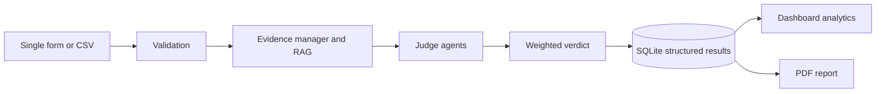

# Explainable Multi-Agent RAG LLM Response Evaluator - Final Project Report

## Problem

AI responses are easy to generate but difficult to assess consistently. A useful evaluator must separate relevance, factual accuracy, grounding, and completeness; preserve evidence provenance; explain its reasoning; and aggregate results without hiding individual failures.

## Implemented solution

The project is a local-first Next.js and FastAPI application. It prepares direct or retrieved evidence, runs four explainable judge components, calculates a weighted verdict, stores the structured result in SQLite, processes CSV batches with failure isolation, presents verified analytics, and exports detailed PDF reports.

## End-to-end workflow

## Agent responsibilities

- Relevance judge measures whether the response answers the question.
- Accuracy judge summarizes support for extracted factual claims.
- Hallucination detector classifies claims as supported, unsupported, or contradicted.
- Completeness judge checks required aspects against available evidence.
- Verdict agent applies configured weights and returns the overall label and score.

## RAG and evidence hierarchy

The evaluator preserves a supplied reference answer, ranks temporary source-text chunks without adding them to the permanent index, and falls back to benchmark retrieval from SQuAD and TruthfulQA. Each evidence chunk retains its dataset, document, source, chunk identifier, metadata, and retrieval distance/score.

## Data and APIs

Pydantic validates inputs and output contracts. ChromaDB stores benchmark chunk embeddings from `sentence-transformers/all-MiniLM-L6-v2`. SQLite stores complete evaluation JSON and searchable summary columns, with optional batch and system provenance. API details are available from FastAPI at `/docs`.

## Dashboard methodology

The dashboard reads stored results only. It reports outcome totals and percentages, mean dimension scores, score distributions, unsupported-claim and missing-aspect frequencies, recurring issue tags, per-batch trends, system filters, and individual drill-down. Mentor-facing outcome thresholds are Pass >= 70, Needs Improvement >= 45, and Fail < 45.

## Reporting

The PDF exporter uses the same stored batch records. It includes batch metadata, executive metrics, dimensional averages, recurring-weakness recommendations, every response and score, judge explanations, unsupported/contradicted claims, missing aspects, evidence excerpts, and the weighted verdict. Long batches paginate automatically.

## Validation

Automated tests cover validation, chunking, normalization, retrieval behavior, persistence, agents, orchestration, CSV parsing, row isolation primitives, dashboard calculations and filters, outcome boundaries, and PDF content. The frontend production build provides a TypeScript and rendering check.

## Limitations

The current agents use deterministic semantic similarity and configurable heuristics, not an external LLM judge. Benchmark coverage depends on the locally ingested index. A production deployment should add authentication, access control, background job processing for very large batches, and calibration against human ratings.

## Future development

Future work may add calibrated LLM judges, human-review queues, experiment versioning, scheduled evaluation runs, confidence intervals, richer system-comparison statistics, and external object storage for high-volume reports.
